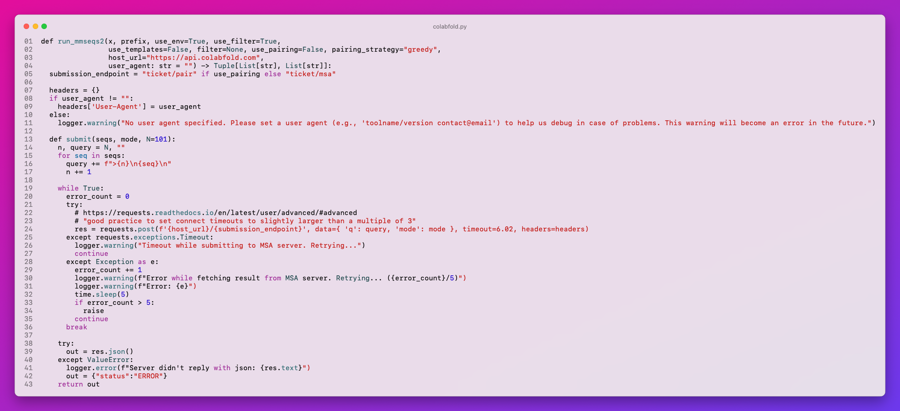

MMseqs2 api.colabfold.com server replacement

For retrieving proteins and target profiles ColabFold calls api.colabfold.com API. This API uses MMseqs2 for retrieving data. API is not open source and does not accept any custom configuration. This project is a replacement for mentioned API. It's open source and allows for configuring which databases you want to use. Only thing that is needed to be changed is url to the mentioned API, which can be found in colabfold.py:

Main functionality that this API introduces:
- Ability to host your own MMseqs2 server with k8s.
- Ability to add additional databases to the analysis.
- Ability to check which databases need to be analysed for each API call.
- API tokens for controlled API usage.